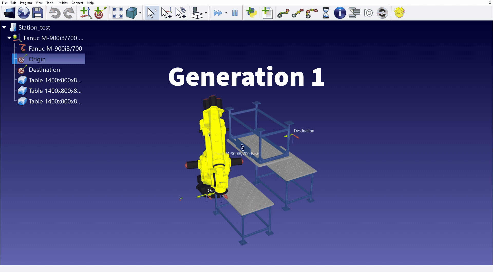
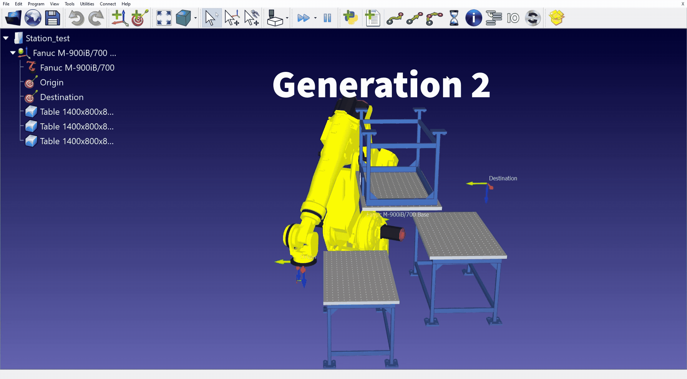
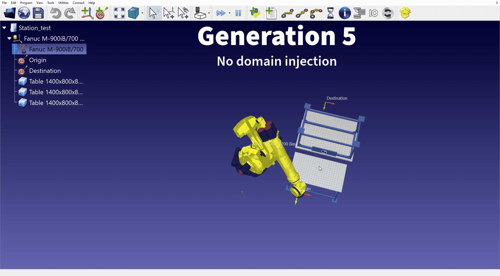
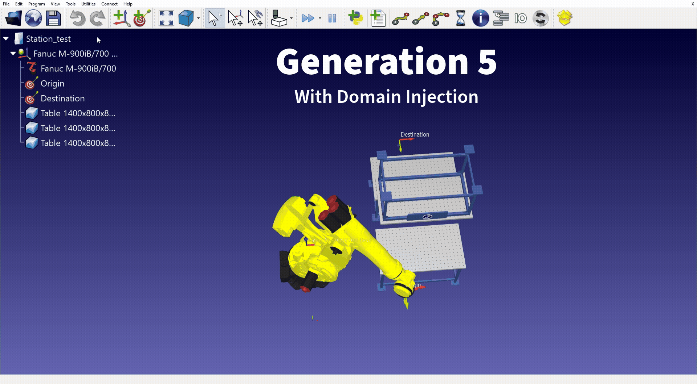

# RobotPathFinderIA
RobotPathFinderIA is a robotics research project focused on finding optimal paths between two points for industrial robots using Evolutionary algorithms.

The project is developed in Python and integrated with RoboDK for robot simulation.
The Genetic Algorith was built from scratch and evaluates the robot paths using a fitness function based on multiple criteria:

-Estimated execution time
-Robot reachabilty
-Collisions detected

The algorithm generates random paths between the Origin point and the Destinaton point and then optimizes evry candidate.
Each candidate path is assigned a fitness score according to these metrics, through selection, corssover and mutation. The population evolves after a few generations progressively improving path quality.

The highest-fitness solution is selected and displayed to the user. 

Generation 1

At the beggining of training,robot moves are completly random without any logical sequence, often crashing into the obstacles or attempting to go to non reachable points.

Generation 2

At this step the algorithm has been training for around 2-3 minutes, movments seem to be a bit more logical, but still the robot is crashing multiple times.

Generation 5

Aroun 10 minutes of training the algorithm has reached generation 5 (though this is the last one in this example, number of generations can be modified). Collisions and non reachable points have been elminated, but the path could be still improved.

Domain Injection

Domain injection in evolutionary algorithms refers to embedding domain-specific knowledge, constraints, or representations into the optimization process to guide search toward more relevant, robust, or interpretable solutions. 

Generation 5 

